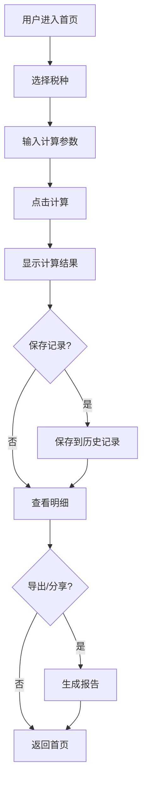

## 1. Product Overview
专为会计人员打造的多功能财务小程序，支持中国全税种、全税目的精准计算，提供即开即用的移动端税务计算体验。

## 2. Core Features

### 2.1 User Roles
| Role | Registration Method | Core Permissions |
|------|---------------------|------------------|
| Normal User | WeChat authorization | Use calculator, save records, manage entities |
| Admin | System assignment | Manage tax policies and parameters |

### 2.2 Feature Modules
1. **首页**: 税种入口、热门税种快捷访问、政策速递
2. **个税计算**: 工资薪金、全年奖、劳务报酬等计税项目
3. **增值税计算**: 含税/不含税金额计算、附加税联动
4. **企业所得税计算**: 小型微利企业/一般企业分类计算
5. **其他税种**: 房产税、印花税、城建税及附加等
6. **历史记录**: 计算记录查询、筛选
7. **常用主体**: 预设企业税费计算模板管理
8. **个人中心**: 用户资料、政策设置、分享导出

### 2.3 Page Details
| Page Name | Module Name | Feature Description |
|-----------|-------------|---------------------|
| 首页 | 热门税种 | 9大税种快捷入口，支持全部税种查看 |
| 首页 | 政策速递 | 最新税务政策公告展示 |
| 个税计算 | 工资薪金 | 输入基本工资、社保公积金、专项附加扣除 |
| 个税计算 | 全年奖 | 年终奖单独计税计算 |
| 个税计算 | 劳务报酬 | 劳务报酬计税计算 |
| 增值税计算 | 计算模块 | 含税/不含税切换、税率选择、附加税联动 |
| 企业所得税 | 计算模块 | 企业类型选择、利润总额输入、优惠政策应用 |
| 历史记录 | 查询模块 | 按时间、税种筛选，查看详情 |
| 常用主体 | 管理模块 | 添加、编辑、删除常用企业主体 |
| 计算明细 | 详情模块 | 显示详细计算公式和步骤 |
| 个人中心 | 设置模块 | 用户资料、政策更新提醒 |

## 3. Core Process

## 4. User Interface Design

### 4.1 Design Style
- Primary color: #1E88E5 (Blue)
- Secondary color: #FF9800 (Orange) for highlights
- Button style: Rounded corners (8px), gradient background for primary buttons
- Font: PingFang SC (iOS), Microsoft YaHei (Android)
- Layout: Card-based design with proper spacing
- Icon style: Modern, minimal line icons

### 4.2 Page Design Overview
| Page Name | Module Name | UI Elements |
|-----------|-------------|-------------|
| 首页 | 头部 | Logo, 标语横幅, 搜索入口 |
| 首页 | 税种网格 | 3x3网格布局, 图标+名称 |
| 首页 | 政策速递 | 列表卡片, 时间标签 |
| 计算页 | 表单区域 | 输入框、下拉选择、开关切换 |
| 计算页 | 结果区域 | 高亮显示税额、税率 |
| 历史记录 | 列表 | 卡片式列表、筛选标签 |
| 常用主体 | 管理 | 添加按钮、编辑/删除操作 |

### 4.3 Responsiveness
- Mobile-first design
- Touch-optimized buttons (min 44px)
- Responsive grid layouts
- Swipe gestures for navigation

### 4.4 Color Scheme
| Usage | Color | Hex |
|-------|-------|-----|
| Primary | Blue | #1E88E5 |
| Success | Green | #4CAF50 |
| Warning | Orange | #FF9800 |
| Error | Red | #F44336 |
| Background | Light Gray | #F5F5F5 |
| Text | Dark Gray | #333333 |