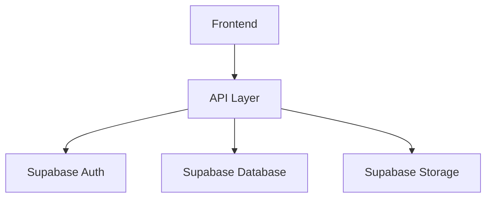
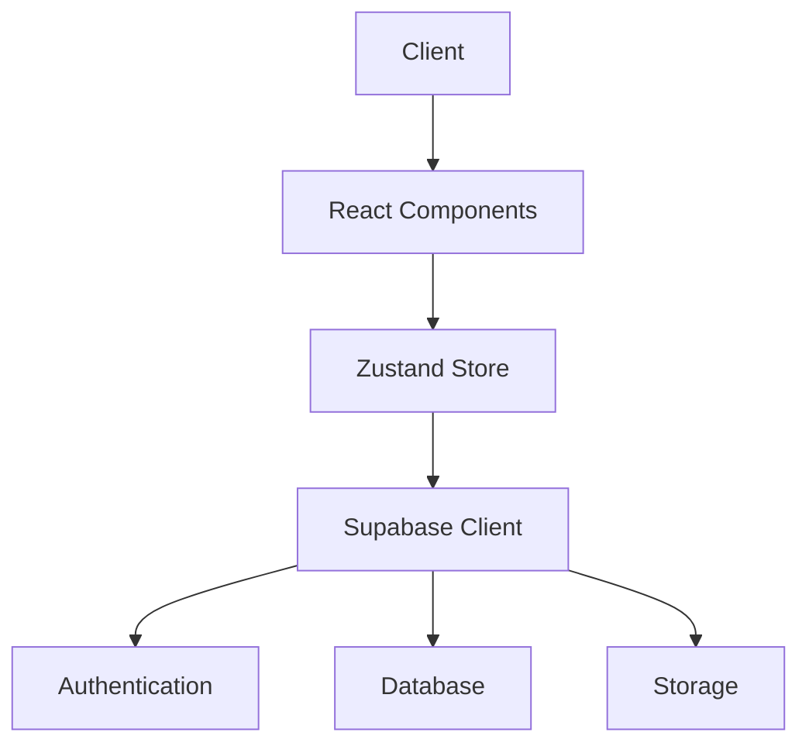
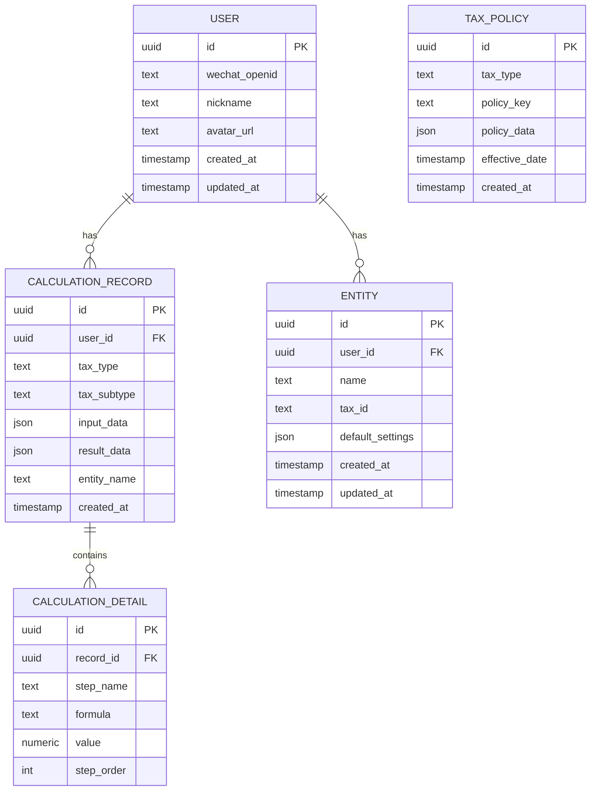

## 1. Architecture Design


## 2. Technology Description
- Frontend: React@18 + TypeScript + tailwindcss@3
- Initialization Tool: vite-init
- Backend: Supabase (Authentication, Database, Storage)
- State Management: Zustand
- Icons: lucide-react

## 3. Route Definitions
| Route | Purpose | Component |
|-------|---------|-----------|
| / | Home page with tax types | Home.tsx |
| /tax/personal | Personal income tax calculator | PersonalTax.tsx |
| /tax/vat | VAT calculator | VatTax.tsx |
| /tax/corporate | Corporate income tax calculator | CorporateTax.tsx |
| /tax/other | Other taxes (property, stamp, etc.) | OtherTaxes.tsx |
| /history | Calculation history records | History.tsx |
| /entities | Common entities management | Entities.tsx |
| /profile | User profile and settings | Profile.tsx |
| /detail/:id | Calculation detail and report | Detail.tsx |

## 4. API Definitions

### 4.1 Tax Calculation APIs (Client-side computation)
- GET /api/tax-rates - 获取税率配置
- POST /api/calculate/personal - 个税计算
- POST /api/calculate/vat - 增值税计算
- POST /api/calculate/corporate - 企业所得税计算

### 4.2 User Data APIs
- GET /api/user/history - 获取用户计算历史
- POST /api/user/history - 保存计算记录
- DELETE /api/user/history/:id - 删除计算记录
- GET /api/user/entities - 获取常用主体
- POST /api/user/entities - 添加常用主体
- PUT /api/user/entities/:id - 更新常用主体
- DELETE /api/user/entities/:id - 删除常用主体

## 5. Server Architecture Diagram


## 6. Data Model

### 6.1 Data Model Definition


### 6.2 Data Definition Language

```sql
-- Users table
CREATE TABLE users (
    id UUID PRIMARY KEY DEFAULT uuid_generate_v4(),
    wechat_openid TEXT UNIQUE,
    nickname TEXT,
    avatar_url TEXT,
    created_at TIMESTAMP DEFAULT NOW(),
    updated_at TIMESTAMP DEFAULT NOW()
);

-- Calculation records table
CREATE TABLE calculation_records (
    id UUID PRIMARY KEY DEFAULT uuid_generate_v4(),
    user_id UUID REFERENCES users(id),
    tax_type TEXT NOT NULL,
    tax_subtype TEXT,
    input_data JSONB,
    result_data JSONB,
    entity_name TEXT,
    created_at TIMESTAMP DEFAULT NOW()
);

-- Calculation details table
CREATE TABLE calculation_details (
    id UUID PRIMARY KEY DEFAULT uuid_generate_v4(),
    record_id UUID REFERENCES calculation_records(id),
    step_name TEXT,
    formula TEXT,
    value NUMERIC,
    step_order INT
);

-- Entities table
CREATE TABLE entities (
    id UUID PRIMARY KEY DEFAULT uuid_generate_v4(),
    user_id UUID REFERENCES users(id),
    name TEXT NOT NULL,
    tax_id TEXT,
    default_settings JSONB,
    created_at TIMESTAMP DEFAULT NOW(),
    updated_at TIMESTAMP DEFAULT NOW()
);

-- Tax policies table
CREATE TABLE tax_policies (
    id UUID PRIMARY KEY DEFAULT uuid_generate_v4(),
    tax_type TEXT NOT NULL,
    policy_key TEXT NOT NULL,
    policy_data JSONB,
    effective_date TIMESTAMP,
    created_at TIMESTAMP DEFAULT NOW()
);

-- Indexes
CREATE INDEX idx_records_user_id ON calculation_records(user_id);
CREATE INDEX idx_records_created_at ON calculation_records(created_at);
CREATE INDEX idx_entities_user_id ON entities(user_id);
CREATE INDEX idx_policies_tax_type ON tax_policies(tax_type);
```

### 6.3 Initial Tax Policy Data

**Personal Income Tax Rates (2024)**
```json
{
    "tax_type": "personal_income",
    "policy_key": "monthly_rates",
    "policy_data": {
        "brackets": [
            {"min": 0, "max": 3000, "rate": 0.03, "deduction": 0},
            {"min": 3000, "max": 12000, "rate": 0.10, "deduction": 210},
            {"min": 12000, "max": 25000, "rate": 0.20, "deduction": 1410},
            {"min": 25000, "max": 35000, "rate": 0.25, "deduction": 2660},
            {"min": 35000, "max": 55000, "rate": 0.30, "deduction": 4410},
            {"min": 55000, "max": 80000, "rate": 0.35, "deduction": 7160},
            {"min": 80000, "max": null, "rate": 0.45, "deduction": 15160}
        ],
        "standard_deduction": 5000,
        "effective_date": "2024-01-01"
    }
}
```

**VAT Rates (2024)**
```json
{
    "tax_type": "vat",
    "policy_key": "rates",
    "policy_data": {
        "general_rates": [
            {"rate": 0.13, "description": "一般纳税人 - 货物销售"},
            {"rate": 0.09, "description": "一般纳税人 - 交通运输、建筑"},
            {"rate": 0.06, "description": "一般纳税人 - 服务、无形资产"}
        ],
        "special_rates": [
            {"rate": 0.03, "description": "小规模纳税人"},
            {"rate": 0.05, "description": "不动产销售、租赁"}
        ],
        "effective_date": "2024-01-01"
    }
}
```

**Corporate Income Tax (2024)**
```json
{
    "tax_type": "corporate_income",
    "policy_key": "rates",
    "policy_data": {
        "general_rate": 0.25,
        "small_profit_enterprise": {
            "threshold": 3000000,
            "rate": 0.20,
            "reduction": 0.25,
            "effective_date": "2023-01-01",
            "expire_date": "2027-12-31"
        },
        "effective_date": "2024-01-01"
    }
}
```

**Additional Taxes**
```json
{
    "tax_type": "additional",
    "policy_key": "rates",
    "policy_data": {
        "urban_maintenance": [
            {"rate": 0.07, "area": "市区"},
            {"rate": 0.05, "area": "县城、镇"},
            {"rate": 0.01, "area": "其他"}
        ],
        "education_surcharge": 0.03,
        "local_education_surcharge": 0.02,
        "effective_date": "2024-01-01"
    }
}
```